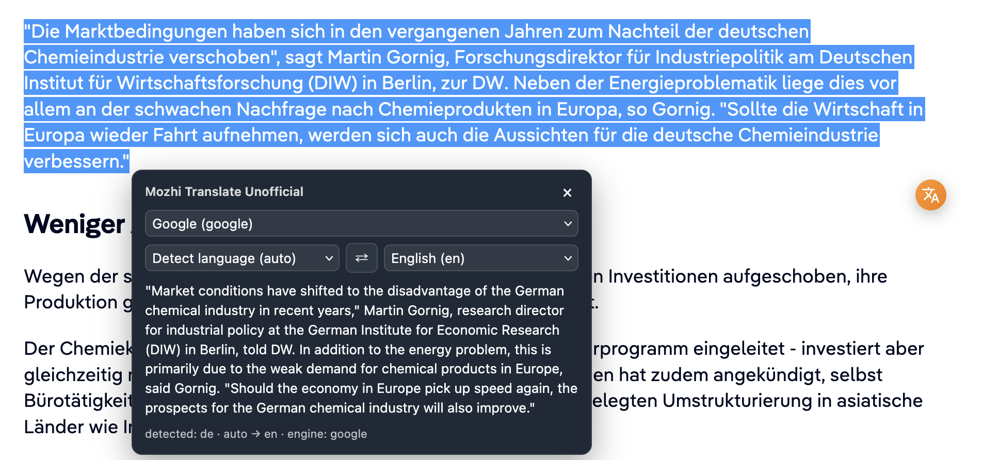
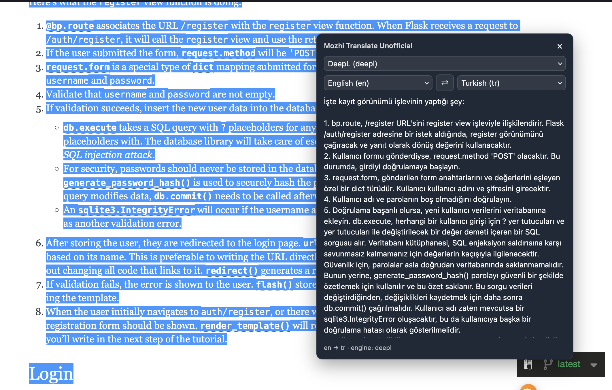
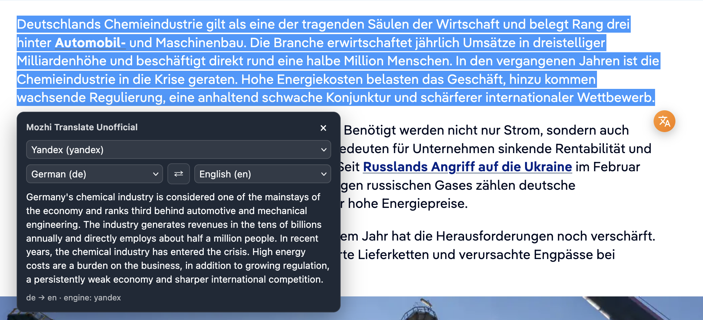

# Mozhi Translate Unofficial Firefox Extension

A privacy-focused Firefox extension that enables seamless web page translation through [Mozhi](https://codeberg.org/aryak/mozhi): an open-source proxy to translation services that strips away their tracking.

Select text on any page, right-click, and get translations without being tracked. No telemetry, no analytics, no remote scripts. Inspired by DeepL translation extension but for Mozhi.

## Features

- **Context Menu Translation**: Right-click on selected text to translate instantly via Mozhi
- **Floating Translate Button**: A quick-access button appears near selected text for one-click translation
- **Popup Interface**: Dedicated popup for typing or pasting text to translate
- **Floating Translation Box**: Draggable, inline translation results displayed directly on the page
- **Multiple Translation Engines**: Supports Google, DeepL, Yandex, and other engines available through Mozhi
- **Language Selection**: Configurable source and target languages with auto-detection
- **Multiple API Endpoints**: Add and enable multiple Mozhi instances; one is randomly selected per translation
- **Translation Cache**: In memory cache (30 minutes TTL, max 100 items) to avoid redundant requests
- **Dark Mode Support**: Automatically adapts to your system's color scheme
- **Self-Host Friendly**: Use a trusted public Mozhi instance or host your own

## Screenshots

| Google | DeepL | Yandex |
|--------|-------|--------|
|  |  |  |

## Installation

[](https://addons.mozilla.org/en-US/firefox/addon/mozhi-translate-unofficial/)

### Temporary Installation (for development/testing)

1. Open Firefox and navigate to `about:debugging`
2. Click **"This Firefox"** in the sidebar
3. Click **"Load Temporary Add-on..."**
4. Select the `manifest.json` file from the project directory


## Usage

### First-Time Setup

1. Click the extension icon in the toolbar
2. Go to **Settings** and configure:
   - **API Endpoint**: Mozhi instance URL (defaults to `https://mozhi.aryak.me`)
   - **Translation Engine**: Google, DeepL, Yandex, etc.
   - **Source/Target Languages**: Your preferred languages
   - **Floating Button**: Enable/disable the selection button

### Translate Text

- **Method 1:** Select text on any webpage and click the floating button
- **Method 2:** Right-click selected text and choose **"Translate selection with Mozhi"**
- **Method 3:** Click the extension icon and type/paste text in the popup

## Configuration Options

| Setting | Default | Description |
|---------|---------|-------------|
| API Endpoint | `https://mozhi.aryak.me` | Mozhi instance URL |
| Engine | `google` | Translation engine (google, deepl, yandex, etc.) |
| Source Language | `auto` | Auto-detect or specific language code |
| Target Language | `en` | Target language code |
| Show Selection Button | `true` | Show floating button after text selection |
| Remember Last Used | `false` | Use last translation config instead of defaults |

## Privacy

This extension is designed with privacy as the core principle:

- **No telemetry**: The extension author collects no data
- **No analytics**: No usage tracking of any kind
- **No remote scripts**: All code runs locally in your browser
- **User-controlled endpoints**: You choose which Mozhi instance to trust, or self-host your own
- **Local settings**: All configuration is stored locally via `browser.storage.local`
- **Translation cache**: Stays in memory and can be cleared from the options page

## How It Works

1. **User selects text** on a webpage
2. The **content script** detects the selection and offers translation via floating button or context menu
3. The **background script** receives the text and calls the configured Mozhi API endpoint
4. **Mozhi** proxies the request to the selected translation engine (Google, DeepL, etc.) without forwarding tracking data
5. The translation result is displayed in a **draggable floating box** on the page

### Architecture

- **`background.js`**: API communication, caching, settings management, context menu
- **`content.js`**: Page injection, UI rendering, text selection handling
- **`popup.html/js`**: Quick translation interface in the toolbar
- **`options.html/js`**: Configuration page for endpoints, languages, and behavior

## Technologies

- **JavaScript (ES6+)**: Core extension logic
- **HTML5 & CSS3**: UI structure and styling with dark mode support
- **Firefox WebExtensions API**: `browser.runtime`, `browser.storage`, `browser.contextMenus`, etc.
- **Shadow DOM**: Isolated UI rendering for translation components
- **Mozhi API**: Translation proxy service

## Project Structure

```
mozhiTranslateFirefox/
├── manifest.json       # Extension manifest
├── background.js       # Background script (API, caching, context menu)
├── content.js          # Content script (page injection, UI, selection)
├── content.css         # Content styles
├── popup.html          # Popup UI
├── popup.js            # Popup logic
├── popup.css           # Popup styles
├── options.html        # Options page UI
├── options.js          # Options page logic
├── options.css         # Options page styles
├── icons/
│   ├── mozhi-48.png    # Toolbar icon (48 px)
│   ├── mozhi-96.png    # Toolbar icon (96 px) and UI logo
│   └── mozhi-128.png   # Add-on listing icon (128 px)
└── screenshots/        # Listing screenshots (not packaged)
```

## Credits

- **Mozhi**: [codeberg.org/aryak/mozhi](https://codeberg.org/aryak/mozhi): The open-source translation proxy that powers this extension

## License

This project uses MIT License.

---

> **Note:** This is an unofficial extension. Mozhi is developed independently at [codeberg.org/aryak/mozhi](https://codeberg.org/aryak/mozhi).
